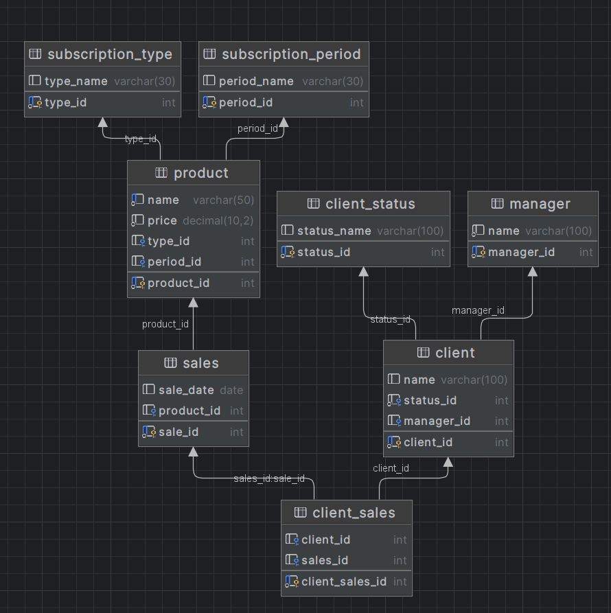
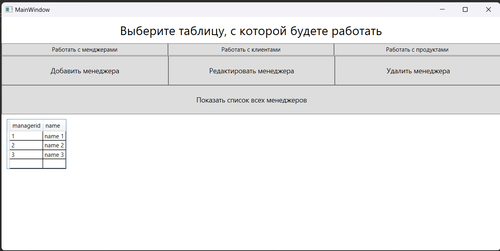
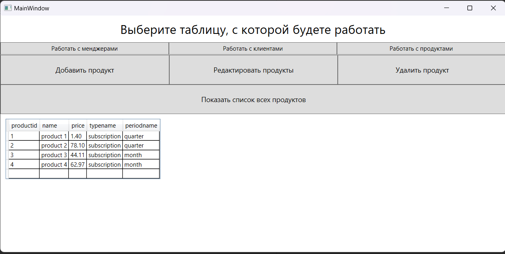

# ProjectMate

### Задание 
Текст задания лежит в файле **Task1\Materials\task.docx**

### Создание базы данных mssql
Инструкция по созданию базы данных лежит в **Task1\Materials\Instruction for database.txt**

База данных имеет следующую структуру:

### Работа с базой данных
Для удобства проверки запросы выписаны в файл **Task1\Materials\Instruction for the database.txt**

### Демонстрация визуального отображения программы

