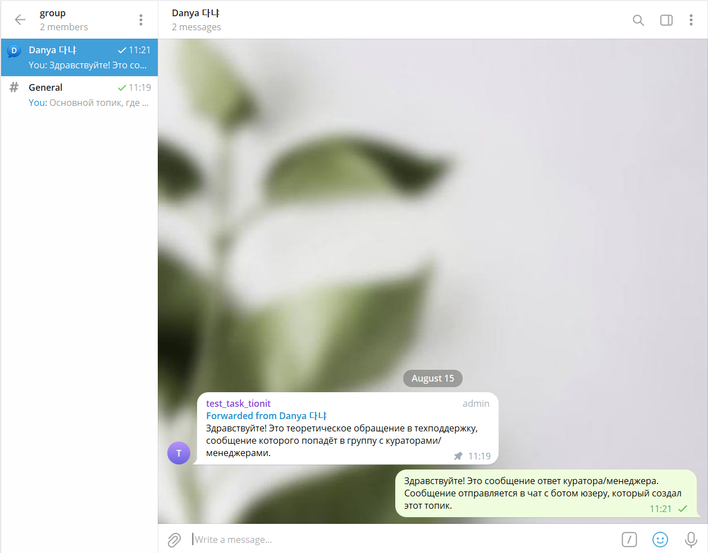
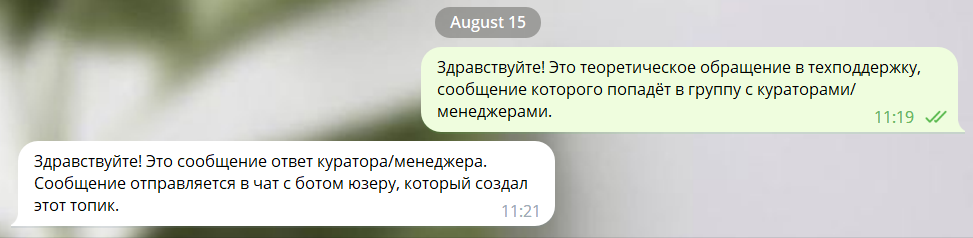

# Telegram bot tionit

## Описание задачи
Создать телеграмм бота для взаимодействия с пользователями (далее по тексту Клиентами).

Клиент пишет сообщение в чат с ботом. 
Автоматически в группе создаётся топик с именем пользователя и туда пересылается его сообщение. 
Ответственные пользователи по работе с клиентами (далее по тексту администраторы) находятся в группе, куда пересылаются сообщения клиента. 
Администраторы отвечают в топик с клиентом "А" и эти сообщения отправляются клиенту "А" в чат с ботом.

## Демонстрация решения
Выбран язык программирования Python, aiogram

Клиент отправялет сообщение в чат с ботом:

Администраторы получают сообщение в автоматически созданном топике и отвечают на сообщение:

Клиент получает ответ на своё сообщение от лица бота:

